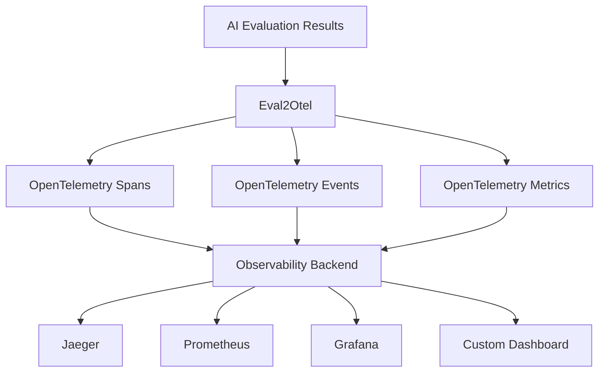

# Eval2Otel

[](https://badge.fury.io/js/eval2otel)
[](http://www.typescriptlang.org/)
[](https://opentelemetry.io/docs/specs/semconv/gen-ai/)
[](https://opensource.org/licenses/MIT)

A comprehensive TypeScript library that converts AI evaluation results to **OpenTelemetry GenAI semantic conventions** for complete observability and monitoring of your AI systems.

## 🎯 Why Eval2Otel?

Modern AI applications need robust observability to understand performance, quality, and behavior. Eval2Otel bridges the gap between your AI evaluation data and industry-standard OpenTelemetry telemetry, enabling:

- **🔍 Complete AI Pipeline Visibility** - Track every evaluation from input to output
- **📊 Standardized Metrics** - Use OpenTelemetry's semantic conventions for consistency
- **🚀 Production Monitoring** - Monitor AI quality and performance in real-time
- **🛡️ Privacy Controls** - Opt-in content capture with built-in data protection
- **⚡ Zero-Config Setup** - Works out of the box with any OpenTelemetry backend

## Features

- 🔍 **OpenTelemetry GenAI Compliance**: Fully compliant with OpenTelemetry semantic conventions for generative AI
- 📊 **Comprehensive Metrics**: Tracks token usage, latency, and custom quality metrics
- 🎯 **Rich Spans & Events**: Creates detailed spans with conversation and choice events
- 🛠️ **Tool Support**: Full support for AI tool execution and function calling
- 🔒 **Privacy Controls**: Opt-in content capturing for sensitive data
- 📈 **Custom Metrics**: Support for evaluation-specific metrics like accuracy, BLEU, ROUGE

## Installation

```bash
npm install eval2otel
```

## Quick Start

```typescript
import { createEval2Otel, EvalResult } from 'eval2otel';

// Initialize the library
const eval2otel = createEval2Otel({
  serviceName: 'my-ai-service',
  serviceVersion: '1.0.0',
  captureContent: true, // Enable content capture (opt-in)
});

// Define your evaluation result
const evalResult: EvalResult = {
  id: 'eval-123',
  timestamp: Date.now(),
  model: 'gpt-4',
  system: 'openai',
  operation: 'chat',
  
  request: {
    model: 'gpt-4',
    temperature: 0.7,
    maxTokens: 1000,
  },
  
  response: {
    id: 'resp-456',
    finishReasons: ['stop'],
    choices: [{
      index: 0,
      finishReason: 'stop',
      message: {
        role: 'assistant',
        content: 'Hello! How can I help you today?',
      },
    }],
  },
  
  usage: {
    inputTokens: 15,
    outputTokens: 12,
  },
  
  performance: {
    duration: 1500, // milliseconds
  },
};

// Process the evaluation
eval2otel.processEvaluation(evalResult);

// Or process with quality metrics
eval2otel.processEvaluationWithMetrics(evalResult, {
  accuracy: 0.95,
  relevance: 0.88,
  toxicity: 0.02,
});
```

## Supported Operations

### Chat Completions
```typescript
const chatEval: EvalResult = {
  operation: 'chat',
  // ... other fields
  conversation: {
    id: 'conv-123',
    messages: [
      { role: 'system', content: 'You are a helpful assistant.' },
      { role: 'user', content: 'Hello!' },
      { role: 'assistant', content: 'Hi there!' },
    ],
  },
};
```

### Tool Execution
```typescript
const toolEval: EvalResult = {
  operation: 'execute_tool',
  // ... other fields
  tool: {
    name: 'get_weather',
    description: 'Get current weather',
    callId: 'call_123',
  },
  response: {
    choices: [{
      message: {
        role: 'assistant',
        toolCalls: [{
          id: 'call_123',
          type: 'function',
          function: {
            name: 'get_weather',
            arguments: { location: 'SF' },
          },
        }],
      },
    }],
  },
};
```

### Embeddings
```typescript
const embeddingEval: EvalResult = {
  operation: 'embeddings',
  // ... other fields
};
```

## Generated OpenTelemetry Data

### Spans
The library creates spans following the `{operation} {model}` naming convention with these attributes:

- `gen_ai.operation.name`: The operation type (chat, embeddings, execute_tool)
- `gen_ai.system`: The AI system (openai, anthropic, etc.)
- `gen_ai.request.model`: Model name
- `gen_ai.request.temperature`: Temperature setting
- `gen_ai.usage.input_tokens`: Input token count
- `gen_ai.usage.output_tokens`: Output token count
- And many more following OpenTelemetry conventions

### Events
When content capture is enabled, the library adds events for:

- `gen_ai.system.message`: System instructions
- `gen_ai.user.message`: User inputs  
- `gen_ai.assistant.message`: Assistant responses
- `gen_ai.tool.message`: Tool call results
- `gen_ai.choice`: Response choices

### Metrics
Automatically recorded metrics include:

- `gen_ai.client.token.usage`: Token usage histogram
- `gen_ai.client.operation.duration`: Operation duration
- `gen_ai.server.time_to_first_token`: Time to first token
- `gen_ai.server.time_per_output_token`: Time per output token
- Custom evaluation metrics (accuracy, BLEU, etc.)

## Configuration

```typescript
interface OtelConfig {
  serviceName: string;           // Required: Service name
  serviceVersion?: string;       // Service version
  captureContent?: boolean;      // Opt-in for sensitive content
  endpoint?: string;            // OpenTelemetry endpoint
}
```

## Privacy & Security

By default, message content is **not captured** to protect sensitive data. Enable content capture only when appropriate:

```typescript
const eval2otel = createEval2Otel({
  serviceName: 'my-service',
  captureContent: false, // Default: content not captured
});
```

## Quality Metrics

Track evaluation-specific metrics:

```typescript
eval2otel.processEvaluationWithMetrics(evalResult, {
  accuracy: 0.95,      // Classification accuracy
  precision: 0.92,     // Precision score
  recall: 0.88,        // Recall score
  f1Score: 0.90,       // F1 score
  bleuScore: 0.85,     // BLEU score for text generation
  rougeScore: 0.82,    // ROUGE score for summarization
  toxicity: 0.02,      // Toxicity score (lower is better)
  relevance: 0.94,     // Relevance score
});
```

## Advanced Usage

### Custom Metrics
```typescript
const metrics = eval2otel.getMetrics();
const customCounter = metrics.createEvalCounter(
  'custom_failures',
  'Number of custom evaluation failures'
);
customCounter.add(1, { 'eval.type': 'custom' });
```

### Batch Processing
```typescript
const evalResults: EvalResult[] = [/* ... */];
eval2otel.processEvaluations(evalResults);
```

### Graceful Shutdown
```typescript
process.on('SIGTERM', async () => {
  await eval2otel.shutdown();
  process.exit(0);
});
```

## Examples

See the `examples/` directory for complete working examples:

- [`basic-usage.ts`](./examples/basic-usage.ts) - Simple chat completion evaluation
- [`tool-execution.ts`](./examples/tool-execution.ts) - Tool/function calling evaluation

## OpenTelemetry Compatibility

This library implements the OpenTelemetry Semantic Conventions for Generative AI:

- [GenAI Spans](https://opentelemetry.io/docs/specs/semconv/gen-ai/gen-ai-spans/)
- [GenAI Events](https://opentelemetry.io/docs/specs/semconv/gen-ai/gen-ai-events/)  
- [GenAI Metrics](https://opentelemetry.io/docs/specs/semconv/gen-ai/gen-ai-metrics/)

## 🏗️ Architecture

Eval2Otel follows OpenTelemetry's semantic conventions and creates structured telemetry data:



### Generated Telemetry

| Type | Purpose | Examples |
|------|---------|----------|
| **Spans** | Operation tracking | `chat gpt-4`, `embeddings text-ada-002` |
| **Events** | Conversation flow | `gen_ai.user.message`, `gen_ai.assistant.message` |
| **Metrics** | Performance & usage | `gen_ai.client.token.usage`, `eval.accuracy` |

## 🤝 Contributing

We welcome contributions! Please see our [Contributing Guide](CONTRIBUTING.md) for details.

### Development Setup

```bash
git clone https://github.com/evalops/eval2otel.git
cd eval2otel
npm install
npm run build
npm test
```

### Running Examples

```bash
# Basic usage example
npx ts-node examples/basic-usage.ts

# Tool execution example  
npx ts-node examples/tool-execution.ts
```

## 📋 Requirements

- Node.js 16+
- TypeScript 5+
- OpenTelemetry SDK

## 🔗 Related Projects

- [OpenTelemetry JavaScript](https://github.com/open-telemetry/opentelemetry-js)
- [OpenTelemetry GenAI Semantic Conventions](https://opentelemetry.io/docs/specs/semconv/gen-ai/)
- [EvalOps](https://github.com/evalops) - AI Evaluation Operations

## 📄 License

This project is licensed under the MIT License - see the [LICENSE](LICENSE) file for details.

## 🙏 Acknowledgments

- OpenTelemetry community for the semantic conventions
- TypeScript team for excellent tooling
- All contributors who help improve AI observability

---

**Built with ❤️ by the [EvalOps](https://github.com/evalops) team**
