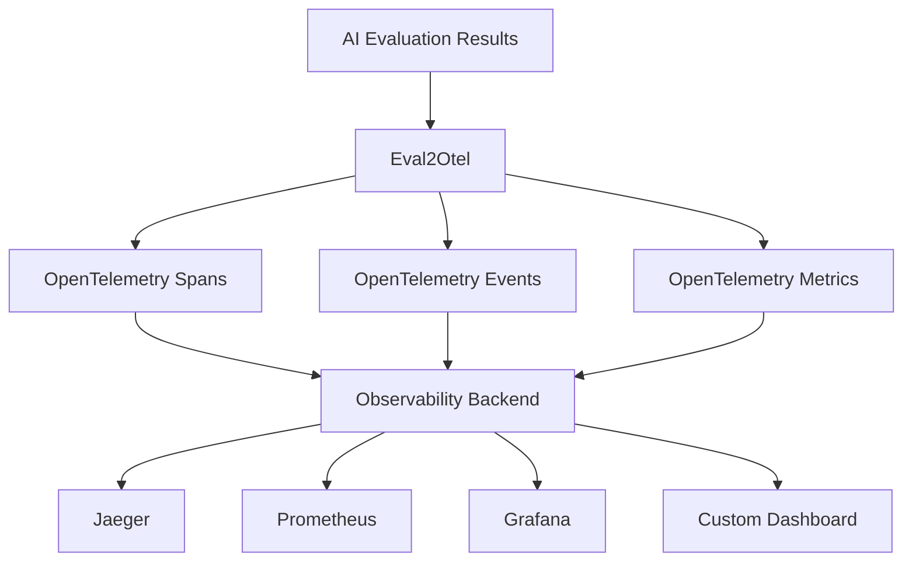

# Eval2Otel

[](https://badge.fury.io/js/eval2otel)
[](http://www.typescriptlang.org/)
[](https://opentelemetry.io/docs/specs/semconv/gen-ai/)
[](https://opensource.org/licenses/MIT)

A comprehensive TypeScript library that converts AI evaluation results to **OpenTelemetry GenAI semantic conventions** for complete observability and monitoring of your AI systems.

## 🎯 Why Eval2Otel?

Modern AI applications need robust observability to understand performance, quality, and behavior. Eval2Otel bridges the gap between your AI evaluation data and industry-standard OpenTelemetry telemetry, enabling:

- **🔍 Complete AI Pipeline Visibility** - Track every evaluation from input to output
- **📊 Standardized Metrics** - Use OpenTelemetry's semantic conventions for consistency
- **🚀 Production Monitoring** - Monitor AI quality and performance in real-time
- **🛡️ Privacy Controls** - Opt-in content capture with built-in data protection
- **⚡ Zero-Config Setup** - Works out of the box with any OpenTelemetry backend

## Features

- 🔍 **OpenTelemetry GenAI Compliance**: Fully compliant with OpenTelemetry semantic conventions for generative AI
- 📊 **Comprehensive Metrics**: Tracks token usage, latency, and custom quality metrics
- 🎯 **Rich Spans & Events**: Creates detailed spans with conversation and choice events
- 🛠️ **Tool Support**: Full support for AI tool execution and function calling
- 🤖 **Agent & Workflow Tracking**: Monitor multi-step AI agent executions and complex workflows
- 📚 **RAG Support**: Specialized metrics for Retrieval-Augmented Generation pipelines
- 🔒 **Privacy Controls**: Opt-in content capturing for sensitive data
- 📈 **Custom Metrics**: Support for evaluation-specific metrics like accuracy, BLEU, ROUGE

## Installation

```bash
npm install eval2otel
```

**Requirements:**
- Node.js 16+ (ESM and CommonJS supported)
- TypeScript 4.5+ (for TypeScript projects)

## Quick Start

```typescript
import { createEval2Otel, EvalResult } from 'eval2otel';

// Initialize the library
const eval2otel = createEval2Otel({
  serviceName: 'my-ai-service',
  serviceVersion: '1.0.0',
  captureContent: true, // Enable content capture (opt-in)
});

// Define your evaluation result
const evalResult: EvalResult = {
  id: 'eval-123',
  timestamp: Date.now(),
  model: 'gpt-4',
  system: 'openai',
  operation: 'chat',
  
  request: {
    model: 'gpt-4',
    temperature: 0.7,
    maxTokens: 1000,
  },
  
  response: {
    id: 'resp-456',
    finishReasons: ['stop'],
    choices: [{
      index: 0,
      finishReason: 'stop',
      message: {
        role: 'assistant',
        content: 'Hello! How can I help you today?',
      },
    }],
  },
  
  usage: {
    inputTokens: 15,
    outputTokens: 12,
  },
  
  performance: {
    duration: 1.5, // seconds
  },
};

// Process the evaluation
eval2otel.processEvaluation(evalResult);

// Or process with quality metrics
eval2otel.processEvaluationWithMetrics(evalResult, {
  accuracy: 0.95,
  relevance: 0.88,
  toxicity: 0.02,
});
```

## Supported Operations

### Chat Completions
```typescript
const chatEval: EvalResult = {
  operation: 'chat',
  // ... other fields
  conversation: {
    id: 'conv-123',
    messages: [
      { role: 'system', content: 'You are a helpful assistant.' },
      { role: 'user', content: 'Hello!' },
      { role: 'assistant', content: 'Hi there!' },
    ],
  },
};
```

### Tool Execution
```typescript
const toolEval: EvalResult = {
  operation: 'execute_tool',
  // ... other fields
  tool: {
    name: 'get_weather',
    description: 'Get current weather',
    callId: 'call_123',
  },
  response: {
    choices: [{
      message: {
        role: 'assistant',
        toolCalls: [{
          id: 'call_123',
          type: 'function',
          function: {
            name: 'get_weather',
            arguments: { location: 'SF' },
          },
        }],
      },
    }],
  },
};
```

### Embeddings
```typescript
const embeddingEval: EvalResult = {
  operation: 'embeddings',
  // ... other fields
};
```

### AI Agent Execution
```typescript
const agentEval: EvalResult = {
  operation: 'agent_execution',
  // ... other fields
  agent: {
    name: 'research-agent',
    type: 'orchestrator',
    plan: 'search -> analyze -> summarize',
    reasoning: 'Multi-source information gathering required',
    steps: [
      { name: 'search', status: 'completed', duration: 2000 },
      { name: 'analyze', status: 'completed', duration: 3500 },
      { name: 'summarize', status: 'running', duration: null }
    ]
  }
};
```

### RAG (Retrieval-Augmented Generation)
```typescript
const ragEval: EvalResult = {
  operation: 'chat',
  // ... other fields
  rag: {
    retrievalMethod: 'hybrid',
    documentsRetrieved: 10,
    documentsUsed: 3,
    chunks: [
      { id: 'doc1_chunk3', source: 'manual.pdf', relevanceScore: 0.92, position: 0, tokens: 256 },
      { id: 'doc2_chunk1', source: 'faq.md', relevanceScore: 0.87, position: 1, tokens: 189 }
    ],
    metrics: {
      contextPrecision: 0.88,
      contextRecall: 0.91,
      answerRelevance: 0.93,
      faithfulness: 0.95
    }
  }
};
```

## Generated OpenTelemetry Data

### Spans
The library creates spans following the `{operation} {model}` naming convention with these attributes:

- `gen_ai.operation.name`: The operation type (chat, embeddings, execute_tool)
- `gen_ai.system`: The AI system (openai, anthropic, etc.)
- `gen_ai.request.model`: Model name
- `gen_ai.request.temperature`: Temperature setting
- `gen_ai.usage.input_tokens`: Input token count
- `gen_ai.usage.output_tokens`: Output token count
- And many more following OpenTelemetry conventions

### Events
When content capture is enabled (and operational metadata emission is on), the library adds events for:

- `gen_ai.system.message`: System instructions
- `gen_ai.user.message`: User inputs  
- `gen_ai.assistant.message`: Assistant responses
- `gen_ai.tool.message`: Tool call results

### Metrics
Automatically recorded metrics include:

- `gen_ai.client.token.usage`: Token usage histogram
- `gen_ai.client.operation.duration`: Operation duration
- `gen_ai.server.time_to_first_token`: Time to first token
- `gen_ai.server.time_per_output_token`: Time per output token
- Custom evaluation metrics (accuracy, BLEU, etc.)

## Configuration

```typescript
interface OtelConfig {
  serviceName: string;           // Required: Service name
  serviceVersion?: string;       // Service version
  environment?: string;          // Deployment environment
  captureContent?: boolean;      // Opt-in for sensitive content
  sampleContentRate?: number;    // Content sampling rate (0.0-1.0)
  contentMaxLength?: number;     // Optional: truncate captured content (characters)
  markTruncatedContent?: boolean; // Optional: add gen_ai.message.content_truncated flag when truncated
  contentSampler?: (evalResult: EvalResult) => boolean; // Optional custom sampler
  emitOperationalMetadata?: boolean; // Suppress conversation/choice/agent/RAG events when false (default true)
  redact?: (content: string) => string | null; // Custom redaction
  redactMessageContent?: (content: string, info: { role: string }) => string | null; // Field-level redaction
  redactToolArguments?: (argsJson: string, info: { functionName: string; callId?: string }) => string | null; // Field-level redaction
  endpoint?: string;            // OpenTelemetry endpoint
  exporterProtocol?: 'grpc' | 'http/protobuf' | 'http/json'; // OTLP protocol
  exporterHeaders?: Record<string, string>; // OTLP headers (e.g., auth)
  // Per-signal OTLP overrides
  tracesEndpoint?: string;
  metricsEndpoint?: string;
  logsEndpoint?: string;
  tracesHeaders?: Record<string, string>;
  metricsHeaders?: Record<string, string>;
  logsHeaders?: Record<string, string>;
  resourceAttributes?: Record<string, string | number | boolean>;
}

## Upgrade to 0.3.x

- Event attribute names for conversation and assistant messages are normalized to `gen_ai.*`:
  - Conversation: `gen_ai.message.role`, `gen_ai.message.index`, `gen_ai.message.content`, `gen_ai.tool.call.id`.
  - Assistant: `gen_ai.response.choice.index`, `gen_ai.response.finish_reason`, `gen_ai.message.role`, `gen_ai.message.content`.
- New options: `emitOperationalMetadata`, `contentMaxLength`, `markTruncatedContent`, `contentSampler`, `redactMessageContent`, `redactToolArguments`.
- Units: `performance.duration` is in seconds; `agent.step.duration` remains in milliseconds. Update any examples or integrations accordingly.

## Using Attribute Constants

For convenience and to avoid typos, the package exports `ATTR` constants for common event attributes:

```ts
import { ATTR } from 'eval2otel';

// Example usage when inspecting events
event.attributes[ATTR.MESSAGE_CONTENT];
event.attributes[ATTR.RESPONSE_CHOICE_INDEX];
event.attributes[ATTR.TOOL_ARGUMENTS];
```

## Signal-specific OTLP Config

You can override endpoints and headers per signal while keeping a global default:

```ts
createEval2Otel({
  serviceName: 'my-app',
  endpoint: 'https://otlp.example.com', // global
  exporterProtocol: 'http/protobuf',
  exporterHeaders: { Authorization: 'Bearer global' },

  // Per-signal overrides
  tracesEndpoint: 'https://otlp.example.com/v1/traces',
  metricsEndpoint: 'https://otlp.example.com/v1/metrics',
  logsEndpoint: 'https://otlp.example.com/v1/logs',
  tracesHeaders: { Authorization: 'Bearer traces' },
  metricsHeaders: { Authorization: 'Bearer metrics' },
  logsHeaders: { Authorization: 'Bearer logs' },
});
```
```

## OpenTelemetry Mapping

eval2otel follows OpenTelemetry GenAI semantic conventions. Here's how `EvalResult` maps to OTel attributes:

### Spans

| Operation | Span Name | Description |
|-----------|-----------|-------------|
| `chat` | `gen_ai.chat` | Chat/completion operations |
| `text_completion` | `gen_ai.chat` | Text completion operations |
| `embeddings` | `gen_ai.embeddings` | Embedding generation |
| `execute_tool` | `gen_ai.execute_tool` | Tool execution |
| `agent_execution` | `gen_ai.agent` | AI agent orchestration |
| `workflow_step` | `gen_ai.workflow` | Workflow step execution |

### Span Attributes

| EvalResult Field | OTel Attribute | Type | Description |
|------------------|----------------|------|-------------|
| `operation` | `gen_ai.operation.name` | string | Operation type |
| `system` | `gen_ai.system` | string | AI system (openai, anthropic, etc.) |
| `request.model` | `gen_ai.request.model` | string | Model name |
| `request.temperature` | `gen_ai.request.temperature` | number | Temperature setting |
| `request.maxTokens` | `gen_ai.request.max_tokens` | number | Max tokens limit |
| `request.topP` | `gen_ai.request.top_p` | number | Top-p sampling |
| `request.topK` | `gen_ai.request.top_k` | number | Top-k sampling |
| `usage.inputTokens` | `gen_ai.usage.input_tokens` | number | Input token count |
| `usage.outputTokens` | `gen_ai.usage.output_tokens` | number | Output token count |
| `response.finishReasons` | `gen_ai.response.finish_reasons` | string[] | Completion reasons |
| `conversation.id` | `gen_ai.conversation.id` | string | Conversation identifier |
| `tool.name` | `gen_ai.tool.name` | string | Tool name |
| `error.type` | `error.type` | string | Error classification |

### Events

| Event Name | Trigger | Attributes |
|------------|---------|------------|
| `gen_ai.system.message` | System message | `gen_ai.message.content`, `gen_ai.message.role`, `gen_ai.message.index`, `gen_ai.message.content_truncated?` |
| `gen_ai.user.message` | User message | `gen_ai.message.content`, `gen_ai.message.role`, `gen_ai.message.index`, `gen_ai.message.content_truncated?` |
| `gen_ai.assistant.message` | Assistant response | `gen_ai.message.content`, `gen_ai.message.role`, `gen_ai.response.choice.index`, `gen_ai.response.finish_reason`, `gen_ai.message.content_truncated?` |
| `gen_ai.tool.message` | Tool call/result | `gen_ai.tool.name`, `gen_ai.tool.call.id`, `gen_ai.tool.arguments`, `gen_ai.response.choice.index` |

### Metrics

| Metric Name | Type | Unit | Description |
|-------------|------|------|-------------|
| `gen_ai.client.operation.duration` | Histogram | `s` | Operation duration |
| `gen_ai.client.token.usage` | Counter | `{token}` | Token consumption |
| `gen_ai.server.time_to_first_token` | Histogram | `s` | Time to first token |
| `gen_ai.server.time_per_output_token` | Histogram | `s/{token}` | Time per output token |
| `eval.custom.metric` | Histogram | `1` | Custom quality metrics |

All metrics include attributes for `gen_ai.operation.name`, `gen_ai.request.model`, `gen_ai.system`, and `deployment.environment`.

#### Units

- Client and server durations are in seconds.
- Agent step and validation durations are in milliseconds.
- Ensure inputs match expected units to avoid skewed metrics.

## Privacy & Security

By default, message content is **not captured** to protect sensitive data. Enable content capture only when appropriate:

```typescript
const eval2otel = createEval2Otel({
  serviceName: 'my-service',
  captureContent: false, // Default: content not captured
  sampleContentRate: 0.1, // Sample 10% of content when enabled
  redact: (content) => {
    // Custom redaction for PII
    return content.replace(/\b[A-Za-z0-9._%+-]+@[A-Za-z0-9.-]+\.[A-Z|a-z]{2,}\b/g, '[EMAIL]');
  },
});
```

### Additional Privacy Controls

```typescript
const eval2otel = createEval2Otel({
  serviceName: 'my-service',
  captureContent: true,           // opt-in
  emitOperationalMetadata: false, // suppress conversation/choice/agent/RAG events
  contentMaxLength: 4096,         // truncate captured content
  markTruncatedContent: true,     // add gen_ai.message.content_truncated when applied
  contentSampler: (evalResult) => evalResult.operation !== 'embeddings', // custom sampler
  redactMessageContent: (content, { role }) => role === 'assistant' ? '[REDACTED]' : content,
  redactToolArguments: (args, { functionName }) => functionName === 'sensitive' ? '{}' : args,
});
```

## Backend Integration

eval2otel works with any OpenTelemetry-compatible backend. See [Backend Integration Guide](./docs/backends.md) for specific setup instructions for:

- **Grafana Stack** (Tempo + Loki + Mimir)
- **Honeycomb** 
- **Datadog**
- **New Relic**
- **Jaeger**
- **AWS X-Ray**
- Generic OTLP endpoints

### Quick OTLP Setup

For local development with Jaeger:

```bash
# Start Jaeger with OTLP support
docker run -d --name jaeger \
  -p 16686:16686 \
  -p 4317:4317 \
  -p 4318:4318 \
  jaegertracing/all-in-one:latest \
  --collector.otlp.enabled=true

# Set environment variables
export OTEL_EXPORTER_OTLP_ENDPOINT=http://localhost:4317
export OTEL_EXPORTER_OTLP_PROTOCOL=grpc
```

Then visit http://localhost:16686 to see your traces.

### Starter Dashboards

Pre-built dashboard templates are available in the `dashboards/` directory:
- `grafana-dashboard.json` - Grafana dashboard with quality metrics, performance, and cost analysis
- `datadog-dashboard.json` - Datadog dashboard with SLO tracking and safety metrics

Import these into your monitoring platform for instant visibility into your AI evaluation metrics.

## Quality Metrics

Track evaluation-specific metrics:

```typescript
eval2otel.processEvaluationWithMetrics(evalResult, {
  accuracy: 0.95,      // Classification accuracy
  precision: 0.92,     // Precision score
  recall: 0.88,        // Recall score
  f1Score: 0.90,       // F1 score
  bleuScore: 0.85,     // BLEU score for text generation
  rougeScore: 0.82,    // ROUGE score for summarization
  toxicity: 0.02,      // Toxicity score (lower is better)
  relevance: 0.94,     // Relevance score
});
```

## Advanced Usage

### Custom Metrics
```typescript
const metrics = eval2otel.getMetrics();
const customCounter = metrics.createEvalCounter(
  'custom_failures',
  'Number of custom evaluation failures'
);
customCounter.add(1, { 'eval.type': 'custom' });
```

### Batch Processing
```typescript
const evalResults: EvalResult[] = [/* ... */];
eval2otel.processEvaluations(evalResults);
```

### Graceful Shutdown
```typescript
process.on('SIGTERM', async () => {
  await eval2otel.shutdown();
  process.exit(0);
});
```

## Examples

See the `examples/` directory for complete working examples:

- [`basic-usage.ts`](./examples/basic-usage.ts) - Simple chat completion evaluation
- [`tool-execution.ts`](./examples/tool-execution.ts) - Tool/function calling evaluation
- [`agent-workflow.ts`](./examples/agent-workflow.ts) - Agent execution and RAG evaluation

## OpenTelemetry Compatibility

This library implements the OpenTelemetry Semantic Conventions for Generative AI:

- [GenAI Spans](https://opentelemetry.io/docs/specs/semconv/gen-ai/gen-ai-spans/)
- [GenAI Events](https://opentelemetry.io/docs/specs/semconv/gen-ai/gen-ai-events/)  
- [GenAI Metrics](https://opentelemetry.io/docs/specs/semconv/gen-ai/gen-ai-metrics/)

## 🏗️ Architecture

Eval2Otel follows OpenTelemetry's semantic conventions and creates structured telemetry data:



### Generated Telemetry

| Type | Purpose | Examples |
|------|---------|----------|
| **Spans** | Operation tracking | `chat gpt-4`, `embeddings text-ada-002` |
| **Events** | Conversation flow | `gen_ai.user.message`, `gen_ai.assistant.message` |
| **Metrics** | Performance & usage | `gen_ai.client.token.usage`, `eval.accuracy` |

## 🤝 Contributing

We welcome contributions! Please see our [Contributing Guide](CONTRIBUTING.md) for details.

### Development Setup

```bash
git clone https://github.com/evalops/eval2otel.git
cd eval2otel
npm install
npm run build
npm test
```

### Running Examples

```bash
# Basic usage example
npx ts-node examples/basic-usage.ts

# Tool execution example  
npx ts-node examples/tool-execution.ts
```

## 📋 Requirements

- Node.js 16+
- TypeScript 5+
- OpenTelemetry SDK

## 🔗 Related Projects

- [OpenTelemetry JavaScript](https://github.com/open-telemetry/opentelemetry-js)
- [OpenTelemetry GenAI Semantic Conventions](https://opentelemetry.io/docs/specs/semconv/gen-ai/)
- [EvalOps](https://github.com/evalops) - AI Evaluation Operations

## 📄 License

This project is licensed under the MIT License - see the [LICENSE](LICENSE) file for details.

## 🙏 Acknowledgments

- OpenTelemetry community for the semantic conventions
- TypeScript team for excellent tooling
- All contributors who help improve AI observability

---

**Built with ❤️ by the [EvalOps](https://github.com/evalops) team**
