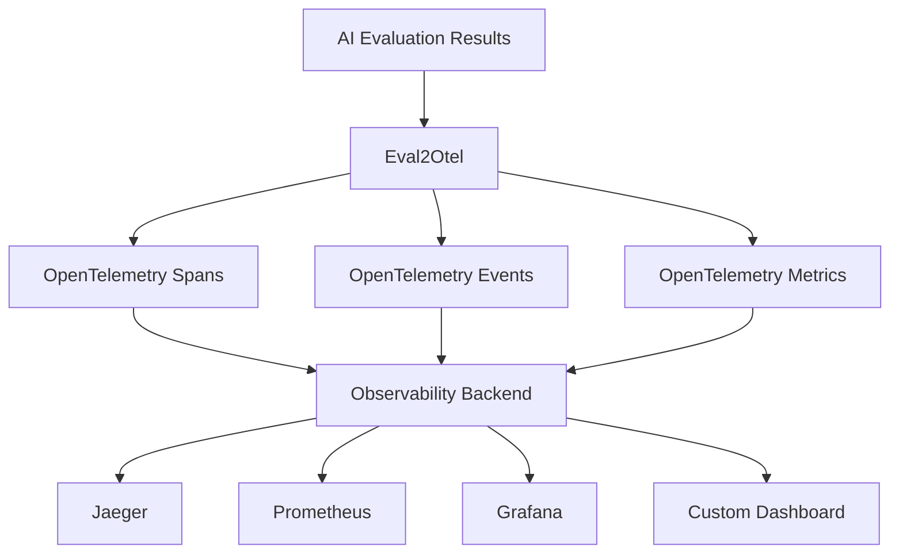

# Eval2Otel

[](https://badge.fury.io/js/eval2otel)
[](http://www.typescriptlang.org/)
[](https://opentelemetry.io/docs/specs/semconv/gen-ai/)
[](https://opensource.org/licenses/MIT)

A comprehensive TypeScript library that converts AI evaluation results to **OpenTelemetry GenAI semantic conventions** for complete observability and monitoring of your AI systems.

## 🎯 Why Eval2Otel?

Modern AI applications need robust observability to understand performance, quality, and behavior. Eval2Otel bridges the gap between your AI evaluation data and industry-standard OpenTelemetry telemetry, enabling:

- **🔍 Complete AI Pipeline Visibility** - Track every evaluation from input to output
- **📊 Standardized Metrics** - Use OpenTelemetry's semantic conventions for consistency
- **🚀 Production Monitoring** - Monitor AI quality and performance in real-time
- **🛡️ Privacy Controls** - Opt-in content capture with built-in data protection
- **⚡ Zero-Config Setup** - Works out of the box with any OpenTelemetry backend
- **🦙 Local LLM Support** - Native integration with Ollama for local model observability

## Features

- 🔍 **OpenTelemetry GenAI Compliance**: Aligns with latest GenAI semconv and emits `gen_ai.provider.name`
- 📊 **Comprehensive Metrics**: Tracks token usage, latency, and custom quality metrics
- 🎯 **Rich Spans & Events**: Creates detailed spans with conversation and choice events
- 🛠️ **Tool Support**: Full support for AI tool execution and function calling
- 🤖 **Agent & Workflow Tracking**: Monitor multi-step AI agent executions and complex workflows
- 📚 **RAG Support**: Specialized metrics for Retrieval-Augmented Generation pipelines
- 🔒 **Privacy Controls**: Opt-in content capturing, truncation flags, and SHA-256 fingerprints when redacted
- 📈 **Custom Metrics**: Support for evaluation-specific metrics like accuracy, BLEU, ROUGE
- 🦙 **Provider Integrations**: Converters for Ollama, OpenAI-compatible, Azure OpenAI, AWS Bedrock, and Google Vertex

## Installation

```bash
npm install eval2otel
```

**Requirements:**
- Node.js 16+ (ESM and CommonJS supported)
- TypeScript 4.5+ (for TypeScript projects)

## Quick Start

```typescript
import { createEval2Otel, EvalResult } from 'eval2otel';

// Initialize the library
const eval2otel = createEval2Otel({
  serviceName: 'my-ai-service',
  serviceVersion: '1.0.0',
  captureContent: true, // Enable content capture (opt-in)
});

// Define your evaluation result
const evalResult: EvalResult = {
  id: 'eval-123',
  timestamp: Date.now(),
  model: 'gpt-4',
  system: 'openai',
  operation: 'chat',
  
  request: {
    model: 'gpt-4',
    temperature: 0.7,
    maxTokens: 1000,
  },
  
  response: {
    id: 'resp-456',
    finishReasons: ['stop'],
    choices: [{
      index: 0,
      finishReason: 'stop',
      message: {
        role: 'assistant',
        content: 'Hello! How can I help you today?',
      },
    }],
  },
  
  usage: {
    inputTokens: 15,
    outputTokens: 12,
  },
  
  performance: {
    duration: 1.5, // seconds
  },
};

// Process the evaluation
eval2otel.processEvaluation(evalResult);

// Or process with quality metrics
eval2otel.processEvaluationWithMetrics(evalResult, {
  accuracy: 0.95,
  relevance: 0.88,
  toxicity: 0.02,
});
```

## Provider Support

eval2otel includes built-in converters for popular AI providers:

- **OpenAI** - GPT models, embeddings, and tools
- **Anthropic** - Claude models and function calling
- **Ollama** - Local LLMs with `convertOllamaToEval2Otel()` and `convertOpenAICompatibleToEval2Otel()`
- **Azure OpenAI** - `convertAzureOpenAIToEval2Otel()`
- **AWS Bedrock** - `convertBedrockToEval2Otel()` (generic mapping)
- **Google Vertex AI (Gemini)** - `convertVertexToEval2Otel()`
- **Custom** - Any provider following the `EvalResult` schema

See the [examples directory](./examples/) for provider-specific integration guides.

## Supported Operations

### Chat Completions
```typescript
const chatEval: EvalResult = {
  operation: 'chat',
  // ... other fields
  conversation: {
    id: 'conv-123',
    messages: [
      { role: 'system', content: 'You are a helpful assistant.' },
      { role: 'user', content: 'Hello!' },
      { role: 'assistant', content: 'Hi there!' },
    ],
  },
};
```

### Tool Execution
```typescript
const toolEval: EvalResult = {
  operation: 'execute_tool',
  // ... other fields
  tool: {
    name: 'get_weather',
    description: 'Get current weather',
    callId: 'call_123',
  },
  response: {
    choices: [{
      message: {
        role: 'assistant',
        toolCalls: [{
          id: 'call_123',
          type: 'function',
          function: {
            name: 'get_weather',
            arguments: { location: 'SF' },
          },
        }],
      },
    }],
  },
};
```

### Embeddings
```typescript
const embeddingEval: EvalResult = {
  operation: 'embeddings',
  // ... other fields
};
```

### AI Agent Execution
```typescript
const agentEval: EvalResult = {
  operation: 'agent_execution',
  // ... other fields
  agent: {
    name: 'research-agent',
    type: 'orchestrator',
    plan: 'search -> analyze -> summarize',
    reasoning: 'Multi-source information gathering required',
    steps: [
      { name: 'search', status: 'completed', duration: 2000 },
      { name: 'analyze', status: 'completed', duration: 3500 },
      { name: 'summarize', status: 'running', duration: null }
    ]
  }
};
```

### RAG (Retrieval-Augmented Generation)
```typescript
const ragEval: EvalResult = {
  operation: 'chat',
  // ... other fields
  rag: {
    retrievalMethod: 'hybrid',
    documentsRetrieved: 10,
    documentsUsed: 3,
    chunks: [
      { id: 'doc1_chunk3', source: 'manual.pdf', relevanceScore: 0.92, position: 0, tokens: 256 },
      { id: 'doc2_chunk1', source: 'faq.md', relevanceScore: 0.87, position: 1, tokens: 189 }
    ],
    metrics: {
      contextPrecision: 0.88,
      contextRecall: 0.91,
      answerRelevance: 0.93,
      faithfulness: 0.95
    }
  }
};
```

## Generated OpenTelemetry Data

### Spans
The library creates spans following the `{operation} {model}` naming convention with these attributes:

- `gen_ai.operation.name`: The operation type (chat, embeddings, execute_tool)
- `gen_ai.system`: The AI system (openai, anthropic, etc.)
- `gen_ai.provider.name`: Provider discriminator (`openai`, `anthropic`, `aws.bedrock`, `azure.openai`, `google.vertex`, `ollama`)
- `gen_ai.request.model`: Model name
- `gen_ai.request.temperature`: Temperature setting
- `gen_ai.usage.input_tokens`: Input token count
- `gen_ai.usage.output_tokens`: Output token count
- And many more following OpenTelemetry conventions

### Events
When content capture is enabled (and operational metadata emission is on), the library adds events for:

- `gen_ai.system.message`: System instructions
- `gen_ai.user.message`: User inputs  
- `gen_ai.assistant.message`: Assistant responses
- `gen_ai.tool.message`: Tool call results

Event attributes preserve structure and mark truncation:
- `gen_ai.message.content_type`: `text` or `json`
- `gen_ai.message.content` or `gen_ai.message.content_json`: Preserves content (truncated by `contentMaxLength`)
- `gen_ai.message.content_truncated=true` when truncation occurred
- `evalops.content_sha256`: Content fingerprint when redaction removed content

### Metrics
Automatically recorded metrics include:

- `gen_ai.client.token.usage`: Token usage histogram
- `gen_ai.client.operation.duration`: Operation duration
- `gen_ai.server.time_to_first_token`: Time to first token
- `gen_ai.server.time_per_output_token`: Time per output token
- Custom evaluation metrics (accuracy, BLEU, etc.)

Streaming support: record TTFT and inter-token timings when provided (client or server streaming).

## Configuration

Key configuration options:

- **serviceName** (required) - Your service identifier
- **captureContent** - Opt-in for message content capture (default: false)
- **sampleContentRate** - Content sampling rate 0.0-1.0
- **redact** - Custom redaction function for PII
- **endpoint** - OpenTelemetry collector endpoint
- **exporterProtocol** - 'grpc' | 'http/protobuf' | 'http/json'

See [TypeScript definitions](./dist/types.d.ts) for complete `OtelConfig` interface.

Advanced options:
- `enableExemplars`: Attach exemplars (trace_id/span_id) to histograms when a span is active
- `metricAttributeAllowlist`: Keep only the listed metric attribute keys
- `maxMetricAttributes`: Cap attributes recorded per metric data point
- `maxEventsPerSpan`: Cap events added to a span (cost/cardinality guard)
- `semconvStabilityOptIn`, `semconvGaVersion`: Pass-through to env (`OTEL_SEMCONV_*`) to pin semconv behavior
- `useSdk=false`: No-SDK mode, emit via global API only
- `sdk`, `manageSdkLifecycle`: Bring-your-own SDK and control lifecycle


## OpenTelemetry Compliance

eval2otel follows [OpenTelemetry GenAI semantic conventions](https://opentelemetry.io/docs/specs/semconv/gen-ai/) for spans, events, and metrics.

Key telemetry generated:
- **Spans**: `gen_ai.chat`, `gen_ai.embeddings`, `gen_ai.execute_tool`
- **Events**: User/assistant/tool messages with content (when enabled)
- **Metrics**: Token usage, operation duration, custom quality scores
- **Attributes**: Model, temperature, tokens, finish reasons, etc.

Resource & semconv behavior:
- Merges `Resource.default()` with your configured attributes; honors `OTEL_SERVICE_NAME` precedence.
- Lets the SDK set `telemetry.sdk.*` attributes; you set `service.name`, `service.version`, `service.namespace`, `service.instance.id` as appropriate.
- Supports `OTEL_SEMCONV_*` env via `semconvStabilityOptIn` / `semconvGaVersion` for forward-compatibility.

## Privacy & Security

By default, message content is **not captured** to protect sensitive data. Enable content capture only when appropriate:

```typescript
const eval2otel = createEval2Otel({
  serviceName: 'my-service',
  captureContent: false, // Default: content not captured
  sampleContentRate: 0.1, // Sample 10% of content when enabled
  redact: (content) => {
    // Custom redaction for PII
    return content.replace(/\b[A-Za-z0-9._%+-]+@[A-Za-z0-9.-]+\.[A-Z|a-z]{2,}\b/g, '[EMAIL]');
  },
});
```

Additional privacy controls available in the [configuration options](#configuration).

Redaction behavior:
- If your redaction hook returns `null`, content is removed and `evalops.content_sha256` is attached for deduplication.
- If your redaction hook returns a string, that value is emitted (and may be truncated with `gen_ai.message.content_truncated=true`).

## Backend Integration

eval2otel works with any OpenTelemetry-compatible backend. See [Backend Integration Guide](./docs/backends.md) for specific setup instructions for:

- **Grafana Stack** (Tempo + Loki + Mimir)
- **Honeycomb** 
- **Datadog**
- **New Relic**
- **Jaeger**
- **AWS X-Ray**

### Quick OTLP Setup

For local development with Jaeger:

```bash
# Start Jaeger with OTLP support
docker run -d --name jaeger \
  -p 16686:16686 \
  -p 4317:4317 \
  -p 4318:4318 \
  jaegertracing/all-in-one:latest \
  --collector.otlp.enabled=true

# Set environment variables
export OTEL_EXPORTER_OTLP_ENDPOINT=http://localhost:4317
export OTEL_EXPORTER_OTLP_PROTOCOL=grpc
```

Then visit http://localhost:16686 to see your traces.

### Starter Dashboards

Pre-built dashboard templates are available in the `dashboards/` directory:
- `grafana-dashboard.json` - Grafana dashboard with quality metrics, performance, and cost analysis
- `datadog-dashboard.json` - Datadog dashboard with SLO tracking and safety metrics

Import these into your monitoring platform for instant visibility into your AI evaluation metrics.

## Quality Metrics

Track evaluation-specific metrics:

```typescript
eval2otel.processEvaluationWithMetrics(evalResult, {
  accuracy: 0.95,      // Classification accuracy
  precision: 0.92,     // Precision score
  recall: 0.88,        // Recall score
  f1Score: 0.90,       // F1 score
  bleuScore: 0.85,     // BLEU score for text generation
  rougeScore: 0.82,    // ROUGE score for summarization
  toxicity: 0.02,      // Toxicity score (lower is better)
  relevance: 0.94,     // Relevance score
});
```

## Advanced Usage

### Custom Metrics
```typescript
const metrics = eval2otel.getMetrics();
const customCounter = metrics.createEvalCounter(
  'custom_failures',
  'Number of custom evaluation failures'
);
customCounter.add(1, { 'eval.type': 'custom' });
```

### Batch Processing
```typescript
const evalResults: EvalResult[] = [/* ... */];
eval2otel.processEvaluations(evalResults);
```

### Graceful Shutdown
```typescript
process.on('SIGTERM', async () => {
  await eval2otel.shutdown();
  process.exit(0);
});
```

## Examples

See the `examples/` directory for complete working examples:

- [`basic-usage.ts`](./examples/basic-usage.ts) - Simple chat completion evaluation
- [`tool-execution.ts`](./examples/tool-execution.ts) - Tool/function calling evaluation
- [`agent-workflow.ts`](./examples/agent-workflow.ts) - Agent execution and RAG evaluation
- [`ollama-basic.js`](./examples/ollama-basic.js) - Basic Ollama integration
- [`ollama-real-test.js`](./examples/ollama-real-test.js) - Real Ollama instance testing
- [`ollama-integration.md`](./examples/ollama-integration.md) - Complete Ollama guide

### CLI: JSONL → OTLP

Replay evaluations from a JSONL file into your OTLP endpoint:

```bash
npx eval2otel-cli ingest \
  --file ./evals.jsonl \
  --service-name evalops-evals \
  --endpoint http://localhost:4317 \
  --protocol grpc \
  --with-exemplars \
  --sample-rate 1.0 \
  --content-cap 4000 \
  --redact-pattern "\\b\\d{16}\\b"
```

Flags:
- `--dry-run` prints a summary without emitting telemetry
- `--provider-override` forces `system`/`gen_ai.provider.name` on all records

## OpenTelemetry Compatibility

This library implements the OpenTelemetry Semantic Conventions for Generative AI:

- [GenAI Spans](https://opentelemetry.io/docs/specs/semconv/gen-ai/gen-ai-spans/)
- [GenAI Events](https://opentelemetry.io/docs/specs/semconv/gen-ai/gen-ai-events/)  
- [GenAI Metrics](https://opentelemetry.io/docs/specs/semconv/gen-ai/gen-ai-metrics/)

## 🏗️ Architecture

Eval2Otel follows OpenTelemetry's semantic conventions and creates structured telemetry data:



### Generated Telemetry

| Type | Purpose | Examples |
|------|---------|----------|
| **Spans** | Operation tracking | `chat gpt-4`, `embeddings text-ada-002` |
| **Events** | Conversation flow | `gen_ai.user.message`, `gen_ai.assistant.message` |
| **Metrics** | Performance & usage | `gen_ai.client.token.usage`, `eval.accuracy` |

## API Reference

### Core API
- `createEval2Otel(config)` - Initialize with OpenTelemetry SDK
- `processEvaluation(evalResult, options?)` - Process single evaluation
- `processEvaluations(evalResults[], options?)` - Batch process

### Provider Converters
- `convertOllamaToEval2Otel()` - Convert Ollama native responses
- `convertOpenAICompatibleToEval2Otel()` - Convert OpenAI-compatible responses

Full API documentation available in [TypeScript definitions](./dist/index.d.ts).

## 🤝 Contributing

We welcome contributions! Please see our [Contributing Guide](CONTRIBUTING.md) for details.

### Development Setup

```bash
git clone https://github.com/evalops/eval2otel.git
cd eval2otel
npm install
npm run build
npm test
```

### Running Examples

```bash
# Basic usage example
npx ts-node examples/basic-usage.ts

# Tool execution example  
npx ts-node examples/tool-execution.ts
```

## 📋 Requirements

- Node.js 16+
- TypeScript 5+
- OpenTelemetry SDK

## 🔗 Related Projects

- [OpenTelemetry JavaScript](https://github.com/open-telemetry/opentelemetry-js)
- [OpenTelemetry GenAI Semantic Conventions](https://opentelemetry.io/docs/specs/semconv/gen-ai/)
- [EvalOps](https://github.com/evalops) - AI Evaluation Operations

## 📄 License

This project is licensed under the MIT License - see the [LICENSE](LICENSE) file for details.

## 🙏 Acknowledgments

- OpenTelemetry community for the semantic conventions
- TypeScript team for excellent tooling
- All contributors who help improve AI observability

---

**Built with ❤️ by the [EvalOps](https://github.com/evalops) team**
